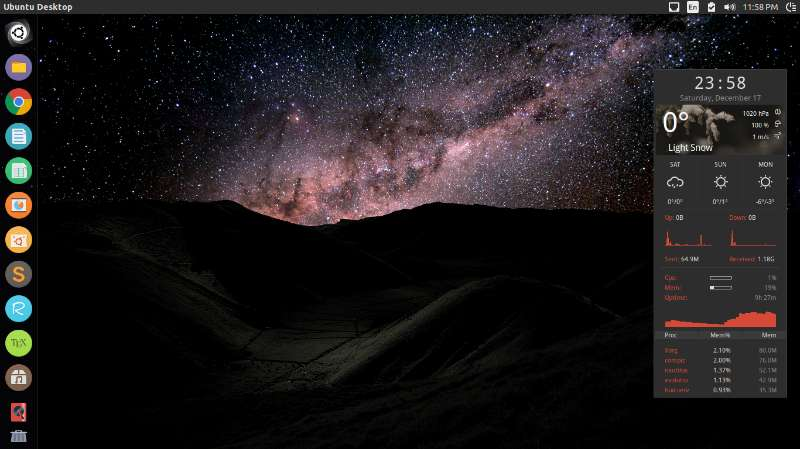

>Ubuntu是Linux系统的更贴近桌面应用的一支，在界面上的美化上也是更为好看。那么，在安装好Ubuntu之后，为了之后使用有个好心情，不妨先美化一番。

## 我的界面

<center><p></p></center>

这就是目前我使用的界面（ubuntu 14.04版本），包括左侧主题图标、右侧conky以及随时间变化的壁纸三个部分。如果你也想要拥有一样的界面，就按照下面步骤配置下去吧。当然，通过修改配置文档，你更可以实现属于你自己的专属界面！

## 设置Numix主题
添加Numix源

```
$ sudo add-apt-repository ppa:numix/ppa
```

安装：

```
$ sudo apt update
$ sudo apt install numix-gtk-theme numix-icon-theme-circle
```

如果你想安装Numix壁纸，再执行

```
$ sudo apt-get install numix-wallpaper-*
```

使用unity-tweak-tool设置主题和图标，执行如下命令安装。

```
$ sudo apt install unity-tweak-tool
```

之后再unity-tweak-tool找到Numix设置为主题就可以了。

安装oxygen cursor

```
$ sudo apt-get install oxygen-cursor-theme
$ sudo update-alternatives --config x-cursor-theme
```

选择cursor主题对应数字，一时间不会改变，需要logout再进去尽可以看到鼠标指针的改变。

参考链接：

[Numix主题安装](http://blog.topspeedsnail.com/archives/5886)

## 使用conky监控

### 安装conky

ubuntu 14.04直接apt-get install安装conky是1.9版本，如果需要使用conky1.10版本则先增加源更新后再安装

```
$ sudo add-apt-repository ppa:vincent-c/conky
$ sudo apt-get update
$ sudo apt-get install conky-all
```

建议再安装其他的部件

```
$ sudo apt-get install curl lm-sensors hddtemp
```

使用conky

```
$ conky -d
Conky: forked to background, pid is 11122
```

关闭conky

```
$ pkill conky
Conky: received SIGINT or SIGTERM to terminate. bye!
```

设置开机启动，打开startup application，增下如下设置

```
Field	Value
Name	conky
Command	conky -p 15
Comment	A system monitor
```

使用conky -p 15是因为保证conky在桌面准备好了时候再打开。
设置conky的文件就是在根目录～/下的.conkyrc文件。可以先使用conky默认配置文件。

```
$ cp /etc/conky/conky.conf ~/.conkyrc
```

之后修改.conkyrc就可以完成conky的实现了。

```
$ vi ~/.conkyrc
```

注意其中ctrl+H可以看隐藏文件，或者勾选view->Show hiden files。

参考链接：

[更新conky源](https://launchpad.net/~vincent-c/+archive/ubuntu/conky)

[安装conky并使用](http://www.shellhacks.com/en/HowTo-Install-and-
Configure-Conky-in-Linux-Mint-Ubuntu-Debian)

### 下载conky文件并修改

个人一开始编辑还是很难，下载的是[Harmattan](https://github.com/zagortenay333/Harmattan)主题，基本完全按照里面的步骤完成配置：

1. 把.harmattan-assets移动到 ~ 目录下

2. 在 .harmattan-themes 中找到各个分类最后的.conkyrc放到 ~ 目录下（只用选择一个，我选择Numix->God-mode->photo mode下的 .conkyrc文件）

3. 在[openweathermap](http://openweathermap.org/)网站中注册帐号，获取到一个API key填写到.conkyrc 中

4. 在网站中找到对应城市的ID编号写到.conkyrc 中

5. 文件在运行中出现错位，所以需要修改位置，修改gap_x=1100, gap_y=60 和voffset后面的值)

参考链接：

[下载conky主题](https://github.com/zagortenay333/Harmattan)

[更改.conkyrc 位置坐标](http://m.blog.csdn.net/article/details?id=52040186)

###  compiz 3D动态

之前在CentOS系统使用过，最常见就是果冻特效和3D切换。但ubuntu安装一次点错选项直接图形界面就崩了，权利太大不建议使用。

一般可以下载一个compiz manager 修改下窗口打开、关闭和最小化的动画。

## Ubuntu壁纸
设置一个随时间变化的壁纸，有很多软件能够实现动态变化的壁纸，可以安装[wallch](http://www.omgubuntu.co.uk/2016/12/8-bit-day-wallpaper-changes-day) 和 [variety](http://ubuntuhandbook.org/index.php/2016/01/install-variety-wallpaper-changer-in-ubuntu-16-04/)，也可以直接用ubuntu自带的[shotwell](http://askubuntu.com/questions/134/how-do-i-create-a-desktop-wallpaper-slideshow)来直接将slideshow设置为桌面背景。

但是这些都需要借助第三方应用，每次还得启动应用，或者有应用的小图标（强迫症接受不了），于是启发于一个随一天时间变化的壁纸 [A Day in the Life](http://barid42.deviantart.com/art/A-Day-in-the-Life-204881196),下载了它的壁纸。但运行install安装并没有反应，查看install.sh文件，发现路径与14.04的壁纸所在文件已经不同了，需要手动配置，这样的好处不需要借助其他应用来修改壁纸，直接在系统设置就能选择壁纸。

那么，博主根据ubuntu 14.04版本手动配置了随一天改变的壁纸文件的xml，并为了方便各位安装写成了脚本（[https://github.com/kaka2634/BestDailyWallpaper](https://github.com/kaka2634/BestDailyWallpaper)），只需按照步骤安装就可以使用啦！


