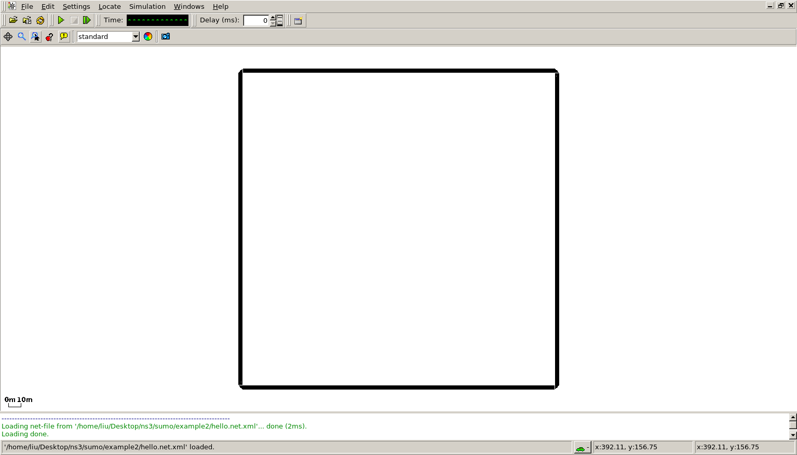

>SUMO(Simulation of Urban MObility) ，是一款模拟真实道路交通的仿真软件，可以通过接口为NS3实现更为真实的车辆移动模型。

## SUMO基本构成

SUMO简单可以由四个部分所构成：

+ Nodes，节点
+ Edges，边
+ Routes，车属性，车轨迹和车流量的设置
+ Configuration 各个文件的连接配置

## SUMO基本过程

首先，由Node（xxx.nod.xml）和Edge(xxx.edg.xml)生成Net（xxx.net.xml），Net文件可以通过open Network查看但是不能仿真。

然后，仿真就需要给Net增加Routes文件（xxx.rou.xml），包含车辆（vehicle）、车辆轨迹（route）、车辆流量（flow）三个部分设置。

最后在Configuration(xxx.sumocfg)文件中，连接Net和Routes文件，并配置仿真属性，就可以实现最基础的仿真。通过sumo根目录下的traceExporter.py还可以获取NS3的移动模型文件。

参考：[使用XML生成自定义地图](http://blog.csdn.net/sxsj333/article/details/22855555)
[Tutorials/Hello Sumo](http://www.sumo.dlr.de/userdoc/Tutorials/Hello_Sumo.html)


## Nodes

为各个节点的分配固定的x,y位置。例如：

```
<nodes>
    <node id="1" x="0.0" y="0.0" />
    <node id="2" x="+250.0" y="0.0" />
    <node id="3" x="+250.0" y="+250.0" />
    <node id="4" x="0.0" y="+250.0" />
</nodes>
```

保存为hello.nod.xml。

## Edges

设置连接各个节点的道路，分配道路属性。例如：

```
<edges>
    <edge from="1" id="1to2" to="2" />
    <edge from="2" id="2to3" to="3" />
    <edge from="3" id="3to4" to="4" />
    <edge from="4" id="4to1" to="1" />
</edges>
```
保存为hello.net.xml。

## Network

根据Nodes和Edges文件可以生成network文件，在所在目录下输入：

```
netconvert --node-files=hello.nod.xml --edge-files=hello.edg.xml --output-file=hello.net.xml
```
可以通过sumo-gui打开network



## Routes

[SUMO routes](http://www.sumo.dlr.de/userdoc/Definition_of_Vehicles,_Vehicle_Types,_and_Routes.html)定义了车辆的属性，车辆的路线轨迹和车辆的流量设置。例如：

```
<routes>
    <vType accel="1.0" decel="5.0" id="Car" length="2.0" maxSpeed="100.0" sigma="0.0"/>
    <flow id="type1" color="1,1,0" begin="0" end="120" period="10" type="Car">
        <route edges="1to2 2to3 3to4 4to1"/>
    </flow>
</routes>
```

保存为hello.rou.xml。 
其中，vType定义了车辆属性，flow定义多久产生车辆而route标签说明车辆的轨迹。

## Configuration

这样，将network和route文件通过configure文件来连接起来。

```
<configuration>
    <input>
        <net-file value="hello.net.xml"/>
        <route-files value="hello.rou.xml"/>
    </input>
    <time>
        <begin value="0"/>
        <end value="10000"/>
    </time>
</configuration>
```

使用sumo命令或在用gui打开cfg文件进行仿真。

## 生成ns3接口文件

参考：[SUMO与NS2连接](http://blog.csdn.net/sxsj333/article/details/22862903)

先生成fcd文件

```
sumo --net-file hello.net.xml --route-files hello.rou.xml --fcd-output hellonet.xml
```

注意file与files的区别。

然后将fcd文件（hellonet.xml）考到SUMO_HOME(/usr/share/sumo)/tools目录下,借用traceExporter.py生成tcl文件。

```
sudo python traceExporter.py --fcd-input hellonet.xml --ns2config-output hello.config.tcl --ns2mobility-output hello.mobility.tcl --ns2activity hello.activity.tcl
```
