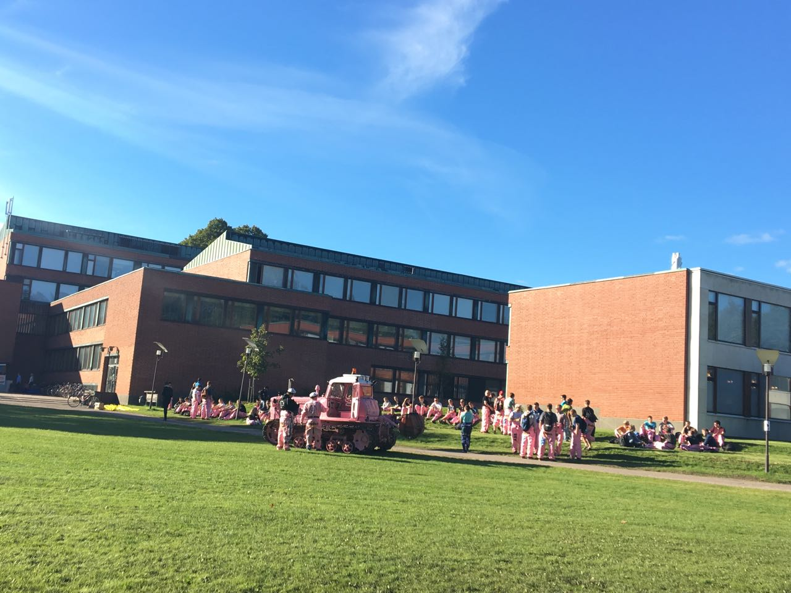
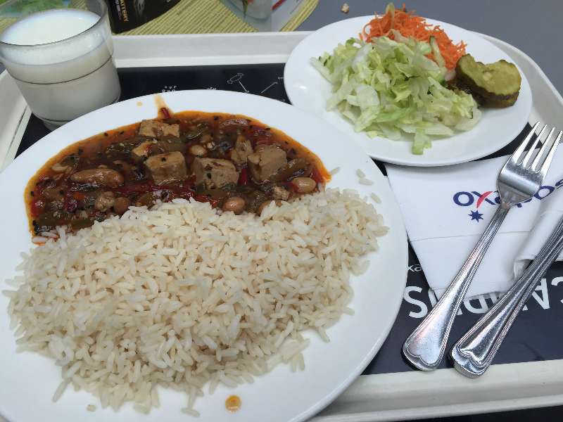
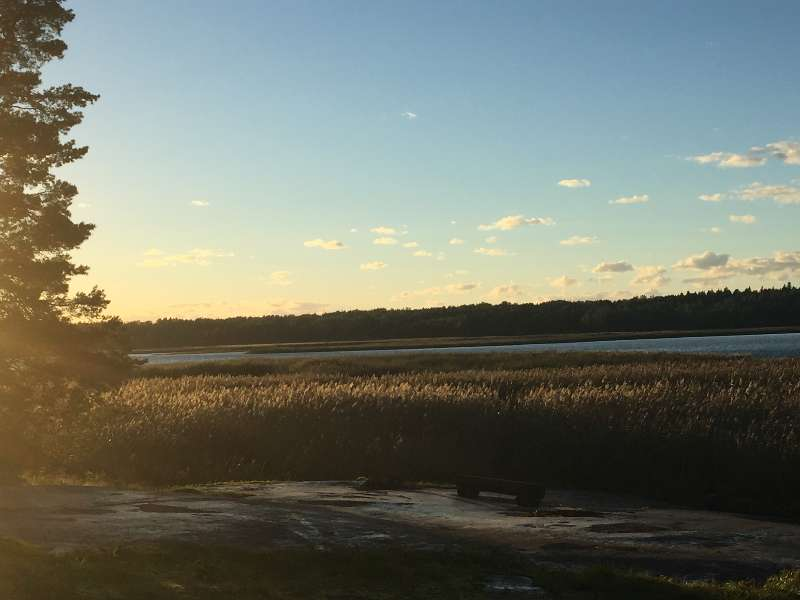
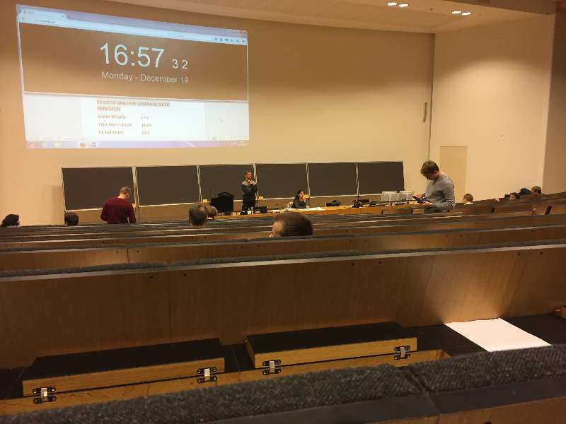
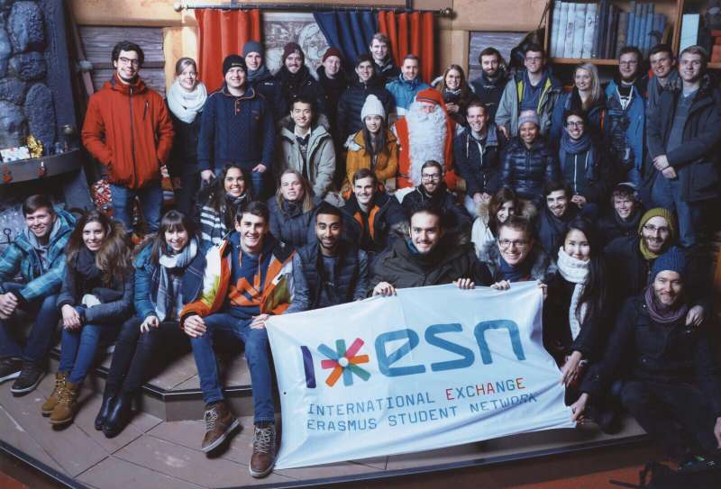

>躺在家里的床上，仿佛刚刚做过了一个漫长的梦，但闭上眼却有那么清晰的记住梦中的片段。

# 行前准备

知道这个阿尔托交换项目还是偶然在论坛看到学校国际处有交换生的项目，便在学院报上了名。等待到了国际处的通知，便按照要求跑表盖章，学校就算可以同意交换了。再之后，通过对方学校也就是阿尔托大学的申请流程，就可以申请分兰的居留证了。

申请只需要按照流程和网上攻略一步步来基本就没有任何问题，唯一产生问题的就是住房了。阿尔托大学由于学生房十分紧缺，是需要在网上排队的，有人搬出才会按照排队先后顺序给房。倘若申请不到，私人房的价格将会是学生房的三倍左右，因而，提前申请十分有必要。申请的网站有AYY和HOAS两个，一定要把能勾的选项都勾上，这样能够加大概率。我当时就是吃了这个亏，一开始只申请了非常靠近学校的位置，一直没有房子。等到反应过来，增加了选项，也才在到达芬兰后的一个月才得到了学生房，期间也多亏了同去的同学申请到了住房让我借住了。

关于航班首推芬航，可以托运两个行李箱。需要带的就基本同于出国必备用品的，记住电源转换头，哪怕在欧洲旅游也要必备的啊，不然不能充电就尴尬了。其他的赫尔辛基市中心也有亚洲超市的，再加入个微信二手群，基本想买的都可以买的到。

八月的一个晴朗的早晨，怀揣着对国外生活的向往与期待，以及些许的紧张，我就出发了。

# 初步生活

刚到芬兰的赫尔辛基，给人第一感觉就是无比的干净，清新的空气，周围没有太多的楼房，到处是绿树和海湾，一眼望去就能看到天边，一下就让刚到新环境的紧张心情放松了下来。虽说芬兰是说芬兰语的，但大多数人都会英语，因而你可以很放心的与他们沟通。学校也会为每个交流生分配一个tutor，来帮助你更快适应这里的生活。

关于饮食，北欧的物价还是很贵的，因而大部分时间都是自己买菜做饭，只偶然去市中心开个小荤。同时，十分推荐在学校吃午餐，学生能够享受半折的优惠，也就是2.6欧一顿，包括主食，主菜，牛奶和蔬菜，以及切片面包。不同的学院基本都有自己的食堂，每天的菜也都不相同，就那里生活四年的同学说，就他也没吃完所有的餐厅。不过，看到奇奇怪怪的菜还是不要尝试了，小心雷区，记得有次点了一个汤，发现就是咸味的绿豆汤加腥鱼肉，没吃完还恶心了一下午。

关于住处，刚开始借住的同学家是AYY分配的房子，位于Otanimie，就在学校里面。并且出门就是海湾。每次饭后都可以沿着海边的森林小路走一圈，有时候还可以去学校旁边的Unisport运动运动，有学生卡在那里办健身卡也有半折的优惠，基本比国内还要便宜，开馆时间也几乎全天。之后，自己分配到的是HOAS的学生房，位Espoo的西海岸的Maininkitie，虽说景色依然迷人，但是距离学校得要1个小时的车程，在冬天的时候，每天只有4个小时的日照时间，因而早上9点还是抹黑出门，下午4点也是抹黑回来，想

要看海边日落，就要2点的时候赶去海边了。

关于交通，赫尔辛基的公共交通还是很便利的，公交、地铁和火车基本覆盖了整个城市。这里普及下赫尔辛基的公交卡，可以分为单程票和月卡两种方式：单程票也就是买一次票，按照是否跨区，区分价格，在有效区中2小时内任何转乘都使用一张票，超出时间和购买区域当然就需要再次购买。那么赫尔辛基公交分为三个区域：Helsinki，Espoo 和 Vantaa。学生单区域是1欧多，双区就是2欧多，三区自然3欧。对于月票来说，按照购买天数可分月卡，季卡和年卡，学生单区域一个月是26欧，加区以此类推。相比于成人学生卡能便宜一半的钱，所以再次说明了即使工作了也要读个研究生保持学生身份的重要性。不过，这边买不买票全看自觉，司机也不会管你，因为你也有可能是转乘，不过如果被查票查到可就赔的多，所以还是买个放心比较好。此外，记得一定要招手公交才会停哦，曾经上前走了几步以为司机大哥心领神会，结果，他径直从我面前开走了。

# 课程学习

作为诺基亚和linux之父的诞生地，能够在芬兰学习还是十分自豪的。因为研一的时候修满了学分，因而到这里就可以全凭兴趣选课了。这里一年分为5个period，冬季学期就包含了1p和2p，有的课程仅在1p内上完，有的课程会跨两个period。我在1p和2p内分别选了一个课程（Machine Learning和 SDN and Network Routing），又选择了一门跨两个period的课程(Mobile Cloud Computing)。

Machine Learning这门课会有5次的作业，一次期中的project和一次期末考试，不过比重最大的还是最后的期末考试了。基本只要自己独立完成所有作业，掌握作业中所应用到的知识就能够顺利通过最后的考试。SDN and Netwok Routing 和Mobile Cloud Computing都包括两次作业和最后的考试，作业是小组合作的形式，并且作业是需要答辩的。第一次和外国学生一起团队合作完成作业还是很紧张的，一开始讨论因为不知道相关的名词，完全不能跟上他们的节奏。后来随着慢慢的学习并完成分配的任务，最后也顺利的达到了要求，这样的经历现在想起了还是十分值得的。其中，学到他们工作的方式是更注重交流和沟通，每天给与一定的反馈，而不是自己一个人默默完成既定的任务。此外，虽说旁听了芬兰语，但是至今也只就记得一二三怎么数。

相比于国内的教育，更多的实践应该就是国外领先的地方。但是在我看来，之所以能够实践，在于他们学校提供了更为丰富的硬件资源，给予了课程教育的最大的支持。至少在阿尔托大学，到处都可以找到自习的场所，提供沙发、阁间以及可以睡觉的地方。同时，到处都有连接了学校云数据中心的电脑，配置最新的windows、linux和macOS系统，只要自己的学生账户就能在任意一台电脑上使用。学生只需专注于所需要研究的知识，而不会因为硬件的不足而去浪费精力。回想起本科痛苦的电路实验，总会因为设备损坏耽误好一段时间，还有安装软件过老导致各种不兼容的问题，以及为了找自习室四处奔波，能够在阿尔托得到交流学习的机会，真的是完全另一种体验。

# 芬兰旅行

芬兰各个城市之间也是十分便利的，大巴和火车连接了各个城市，海边的城市还有海轮可以到达。芬兰的首都赫尔辛基相对的现代化，而芬兰第二大的城市图尔库则是一座相对有着古老建筑的城市，从图尔库出发，通过海轮可以到达芬兰景色迷人的奥兰群岛。亦可以继续北上，经过坦佩雷、奥卢，去往位于拉普兰Rovanimie的圣诞老人村，不仅可以和圣诞老人合影，运气好的话还有机会看到极光。虽然我运气不太好，去了一周都在下雪，但去到了北冰洋，在桑拿房和北冰洋的海水中三进三出，确也留下一次非常美好的经历。如果有机会，还想再去追一次极光。

当然，芬兰去欧洲其他各国也是非常方便，瑞典、挪威和丹麦虽然都是北欧城市，但也各不相同。同时，一个人的旅行也让我学会了如何计划行程，也在途中认识了不少的小伙伴。

# 尾声

最后，衷心感谢学校国际处给予的这次机会，非常感谢赵老师的辛勤工作为我提供了这个平台，还有同去的小伙伴提供的帮助，以及在交流期间遇到的各种好心人。这次难忘的经历改变了很多我的态度，经后时常想起这段记忆，也会开心的笑出来吧！
