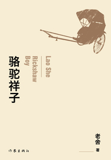

> 我读书有个习惯，看完的小说不会去读第二遍。如此以来一段时间后，就忘却了书中的内容，甚至不记得书名和作者。若再被提起这本书，却记得个大概结局，所以不愿再回头看上个第二遍。想想有自己的博客，现在看完一本小说后，难免会产生一定的思考，便记录下来，自然也就印象深刻。

 
 
祥子是一名拉车夫，骆驼是他的外号。从小失去父母的祥子，十八岁时从乡下进城当起了车夫，他梦想就是拥有一辆属于自己的车。然而，他辛辛苦苦挣到属于自己的第一辆车后，却因为贪风险财，被逃兵掠去。之后，又被车厂老板刘四爷那相貌极丑的女儿虎妞骗了婚。当上厂长女婿并没有捞到半点好处，刘四爷忍不了自己女儿下嫁给一介车夫，翻脸不认女儿，卖了车厂卷钱跑了。而跟着祥子的虎妞，打错了如意算盘，并且自身年龄过大，在生孩子的时候不幸离世。祥子为办葬礼卖去了人生中的第二辆车，自己也为此生了场大病。病好后，祥子找到了之前待自己不错的曹先生，希望他能再次收留自己。曹先生不仅答应祥子可以留下，也答应祥子可以收留之前对祥子有好感的小福子。然而，就当祥子以为他可以跟小福子一起过上贫穷但美好的生活的时，命运再次将他重重的摔在地上。当天，祥子满心欢喜的去打听小福子的消息，才知道她早已受不了屈辱而上吊自杀了。至此，祥子失去了他所有的期望和理想，沾染上了老车夫的恶习，甚至开始厌恨拉车，混吃混喝，彻底地“沦落为个人主义的末路鬼”。

祥子的生活是一种不断向命运妥协的过程，代表着在军阀时代下底层劳苦人民的生活。放在当前，亦可以想到那些来北京北漂的人，怀揣着美好的理想，住着几米的小平房，拿着少的可怜的工资，挤着两小时的地铁，没日没夜的劳作着。不可否认，北京拥有着更多的机会与财富，但是也带来了更多的竞争与压力，快节奏的生活被压缩到只剩工作，不得有一丝放松的时间，似乎每一个人拉着一个叫“理想”的客人。不论这个理想是财富还是名利，是高尚还是俗气，是远大还是短浅，每个人像祥子一样为了属于自己的理想而努力。然而，理想往往美好，现实却很残酷。一开始来到这里，会有新奇感，会有着动力，刻苦工作。但经历不断的碰壁，体会不到家乡的亲切，多少人被现实磨去了当初的棱角，被责骂，被压迫，被驱逐。从学校的房屋拆迁到大兴火灾，都说明北京已经容纳不下那么多的人口，必须减少部分流动人口来缓解这一状况。所以你可以选择北京，北京也可以选择是否留下你。当然，社会也是在进步的，活在当前的社会要远比祥子要幸福，有着社会的福利，不用在为吃不上饭而烦恼，只用为更好的生活而努力。这样来看，还是庆幸能活在当代，再之而来的困难也就源于自身的欲望，源于人们对美好生活的向往。

不仅祥子会带给我相应的思考，其他书中的人物，也可以带来一定的反思。刘四爷，年轻时开过赌场，买卖人口，打过群架，近晚年时开了车厂，靠着一百多辆车过着富足生活。但他的性格固执且专断，唯一的女儿嫁给了车夫后，也无人送终。虎妞，不仅相貌丑陋，内心也在极为的自私，为了自己的目的不择手段，把老实的祥子玩弄于股掌之间，不过还是没自作孽不可活的悲剧。从此来看，相比于财富的富足，心灵的富足显得更为重要。一味的追求财富，反而会使用卑劣的手段，心灵也自然得到扭曲，哪怕即使获得了数不尽的钱财，结局往往也是悲剧。

相对正面的曹先生一家，虽说没有富足的财富，却有着富足的心灵。但是在那个时代下，也会因为思想的激进，被坏人告发，而逃到上海。而作为告发者的知识分子阮明，更是因为思想的革命，而被抓起来当众处刑。现在社会充斥着各种信息，各种媒体手段层出不穷，人们有着更多的发声渠道，拥有着法律所保护的言论自由。但言论自由的同时，也有着辨别是非的义务，不能被一些错误的谣言怂恿。国家针对网络中行为规范早已开始一定的规范，更多的保护就是那些没有自主思考的人们。也根据近期的事件告诫国内的同学们，约束自己的言行，明辨是非。