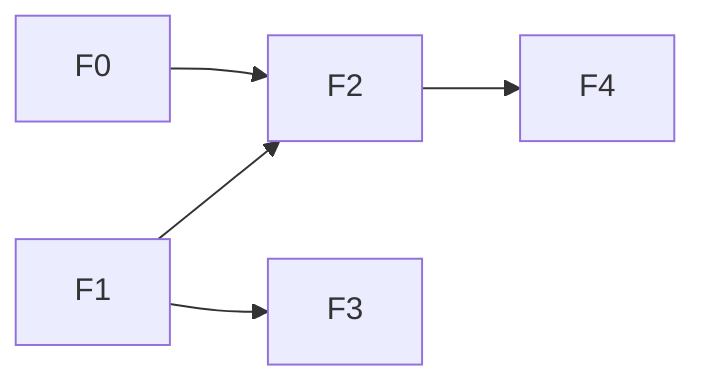
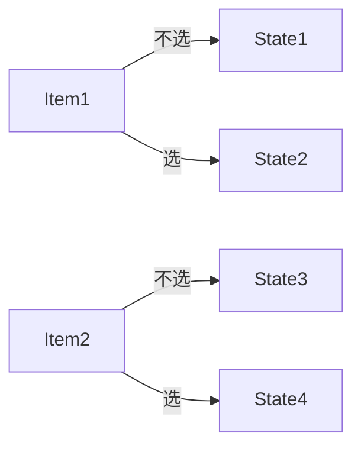
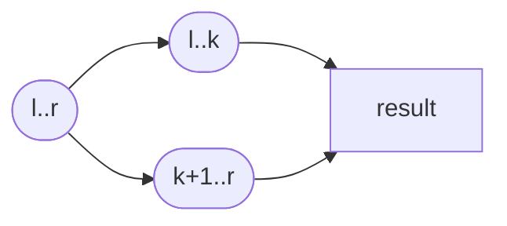

> 摘要：本文以学习者视角系统介绍动态规划（DP）的核心思想、常见变体与实现要点，配以若干典型例题的 Java 代码与图示解析，帮助你建立解题模板与工程实现能力。

## 1. 什么是动态规划

动态规划是一类通过将问题分解为相互重叠的子问题并保存子问题结果来避免重复计算的算法思想。解决 DP 问题通常遵循五步法：

- 划分子问题（定义状态）
- 写出状态转移方程（递推关系）
- 确定初始状态和边界条件
- 确定计算顺序（自底向上或自顶向下+记忆化）
- （可选）状态压缩或空间优化

用公式描述：若问题可由若干较小子问题线性组合得到，则可用 dp 表示子问题最优值，转移形如 dp[state]=min/max/sum( some dp[smaller_state] )。

下图给出 DP 的抽象流程：


## 2. 常见动态规划类型概览

- 线性 DP（1D/数组 DP）：如斐波那契、最小路径和。
- 区间 DP：如区间合并、石子合并。
- 树上 DP：对子树状态合并的问题。
- 背包类 DP：0/1 背包、完全背包、分组背包。
- 最长类问题：LIS、最长回文子串/子序列。
- 状态压缩 DP：小 n 全子集遍历（TSP 等）。
- 数位 DP：按位统计满足条件的数。

下面挑选若干典型问题进行说明与代码演示。

## 3. 例题 1：斐波那契（入门，1D DP）

问题：计算第 n 个斐波那契数（假设 n >= 0），递推关系为 F_n = F_{n-1} + F_{n-2}，且 F_0=0, F_1=1。

思路：状态为 dp[i]=F_i，转移 dp[i]=dp[i-1]+dp[i-2]。

图示（状态依赖）：



Java 实现（迭代 + 常数空间）：

```java
public static long fib(int n) {
    if (n <= 1) return n;
    long a = 0, b = 1;
    for (int i = 2; i <= n; i++) {
        long c = a + b;
        a = b;
        b = c;
    }
    return b;
}
```

时间复杂度 O(n)，空间复杂度 O(1)。

## 4. 例题 2：0/1 背包（典型背包 DP）

问题描述：给定容量为 W 的背包和 N 件物品，每件物品有重量 w[i] 和价值 v[i]，每件最多选一次，求最大价值。

状态定义：dp[i][j] 表示考虑前 i 件物品，在容量恰为 j 时的最大价值。

状态转移：

dp[i][j] = max( dp[i-1][j], dp[i-1][j-w_i] + v_i )  （当 j >= w_i 时）

初始化：dp[0][*]=0。

图示（决策树示意）：



Java 二维写法（直观）：

```java
public static int knapsack01(int W, int[] wt, int[] val) {
    int n = wt.length;
    int[][] dp = new int[n+1][W+1];
    for (int i = 1; i <= n; i++) {
        for (int j = 0; j <= W; j++) {
            dp[i][j] = dp[i-1][j];
            if (j >= wt[i-1]) {
                dp[i][j] = Math.max(dp[i][j], dp[i-1][j - wt[i-1]] + val[i-1]);
            }
        }
    }
    return dp[n][W];
}
```

Java 一维滚动数组优化（空间 O(W)）：注意循环方向必须倒序以保证状态不被覆写。

```java
public static int knapsack01Opt(int W, int[] wt, int[] val) {
    int n = wt.length;
    int[] dp = new int[W+1];
    for (int i = 0; i < n; i++) {
        for (int j = W; j >= wt[i]; j--) {
            dp[j] = Math.max(dp[j], dp[j - wt[i]] + val[i]);
        }
    }
    return dp[W];
}
```

复杂度：时间 O(NW)，空间可降到 O(W)。

## 5. 例题 3：最长上升子序列（LIS）

问题：在数组中找最长严格上升子序列的长度。

方法一：O(n^2) 的 DP。状态 dp[i] 表示以位置 i 结尾的 LIS 长度：

dp[i] = 1 + max_{j<i, a[j]<a[i]} dp[j]

代码：

```java
public static int lisN2(int[] a) {
    int n = a.length;
    int[] dp = new int[n];
    Arrays.fill(dp, 1);
    int ans = 1;
    for (int i = 0; i < n; i++) {
        for (int j = 0; j < i; j++) {
            if (a[j] < a[i]) dp[i] = Math.max(dp[i], dp[j] + 1);
        }
        ans = Math.max(ans, dp[i]);
    }
    return ans;
}
```

图示（比较依赖）：

```mermaid
sequenceDiagram
participant A as a[0]
participant B as a[1]
participant C as a[2]
Note over A,B,C: 每个元素向前比较并继承最优子解
```

方法二：耐心排序 + 二分 (O(n log n))，只返回长度：

```java
public static int lisNlogN(int[] a) {
    int n = a.length;
    int[] tail = new int[n];
    int size = 0;
    for (int x : a) {
        int i = Arrays.binarySearch(tail, 0, size, x);
        if (i < 0) i = -i - 1;
        tail[i] = x;
        if (i == size) size++;
    }
    return size;
}
```

## 6. 例题 4：分治类 & 区间 DP 概念（示例：石子合并）

区间 DP 常用于合并区间 / 区间最优构造，典型状态 dp[l][r] 表示区间 [l,r] 的最优值，转移通常枚举划分点 k：

dp[l][r] = min_{l<=k<r} ( dp[l][k] + dp[k+1][r] + cost(l,r) )

图示（区间划分）：



区间 DP 往往 O(n^3)，需观察是否有单调队列/四边形不等式等优化条件。

## 7. 例题 5：树形 DP（简单模板）

树上 DP 的关键是以某个结点为根的子树状态合并。常用 DFS 自底向上计算子树信息，然后合并得到父结点状态。

示例（计算每个结点作为根的子树大小）：

```java
List<Integer>[] g; int[] sz;
void dfs(int u, int p) {
    sz[u] = 1;
    for (int v : g[u]) if (v != p) {
        dfs(v, u);
        sz[u] += sz[v];
    }
}
```

更复杂的树上 DP（如树形背包）则需要在合并子树时进行多重循环或使用暂存数组。

## 8. 常见技巧与模板

- 记忆化（自顶向下）与自底向上：根据问题大小和递归深度选择。
- 空间压缩：若转移只依赖前一行，考虑滚动数组。
- 状态设计比写代码更关键：试着把问题拆成最小可重叠子问题。
- 注意循环方向（背包一维倒序）与边界初始化（-INF 或 0）。

## 9. 高级 DP 主题

- **状态压缩 DP**：当某个维度（如选择集合）大小较小时，可用二进制位掩码表示状态，枚举子集或子掩码。常见于 TSP、集合覆盖、状态转移图等。
  ```java
  int N; double[][] dist; // N<=16
  double[] dp = new double[1<<N];
  Arrays.fill(dp, Double.POSITIVE_INFINITY);
  dp[1]=0; // start at node0
  for(int mask=1;mask<1<<N;mask++){
      for(int u=0;u<N;u++) if((mask>>u&1)!=0){
          for(int v=0;v<N;v++) if((mask>>v&1)==0){
              dp[mask|(1<<v)] = Math.min(dp[mask|(1<<v)], dp[mask]+dist[u][v]);
          }
      }
  }
  ```
- **数位 DP 与位状态压缩**：枚举数字的每一位时用额外的标志位记录是否已低于上界、是否出现某个前缀等。
- **优化技巧**：单调队列优化斜率、四边形不等式（Knuth 优化、分治优化）、矩阵快速幂转移、倍增预处理。
- **二维/三维 DP 的降维手法**：观察状态依赖仅在前 k 层时，可以用滚动数组或环形队列；对 DP 表进行前缀和/差分转化加速。
- **设计辅助结构**：例如线段树/树状数组维护最优子状态、堆优化加速 Dijkstra 样式的 DP。

## 10. 额外的编码/空间压缩技巧

- **位运算打包**：把多个布尔或小整数压进去一个 `int`/`long`，在状态转移时用移位和掩码读写。
  ```java
  int pack(int a,int b){return (a<<16)|b;}
  int a = packVal>>16;
  ```
- **使用 `byte`/`short` 代替 `int`** 保存 dp 值，当答案范围较小时可节省内存并提高缓存命中率。
- **`BitSet` 或自定义位数组** 实现布尔向量化转移（比如状态压缩 DP 的快速子集枚举）。
- **稀疏状态存储**：当有效状态很少时，用 `HashMap`/`unordered_map` 存储 / 记忆化而不是构建完整的数组。
- **预计算转移或状态编码**：把复杂的状态转移拆成固定的查表过程，尤其在多维 DP 中常见。
- **循环合并与分支预测友好**：把 if-else 拉到外部减少分支，让 CPU 预测更准确。
- **C++ 方面**：使用 `alloca`/自定义内存池减少频繁 new/delete；`__builtin_prefetch` 预取内存。


