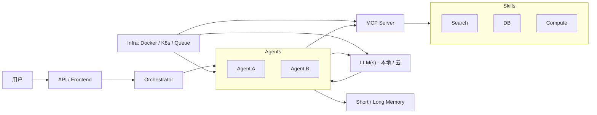
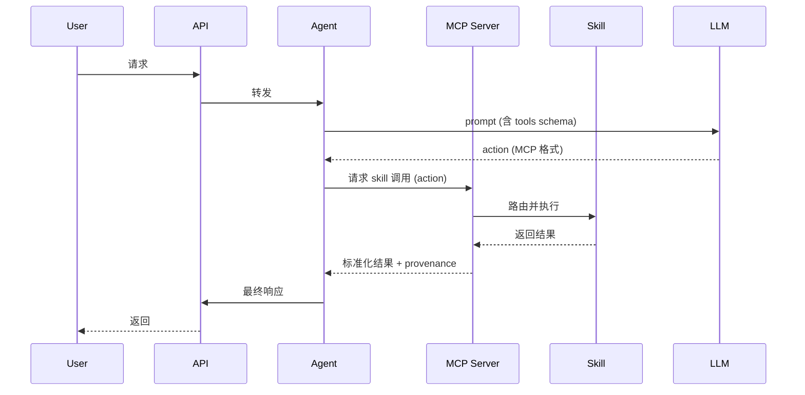

> 本文以统一视角解释大型语言模型（LLM）、Agent、MCP（Model/Model-Context Protocol）、Skill 与 MCP Server 之间的关系，给出整体架构图、交互流程、最小可运行实现思路与安全/运维建议，便于工程化落地。

## 概述
本文档以统一视角解释大型语言模型（LLM）、Agent、MCP（Model/Model-Context Protocol）、Skill 与 MCP Server 之间的关系，给出整体架构图、交互流程、最小可运行实现思路与安全/运维建议，便于工程化落地。

---

## 快速结论
- **LLM**：提供语言理解与生成的能力（“脑”）。
- **Agent**：负责决策、调用能力并执行副作用的控制器（“手/调度器”）。
- **Skill**：对具体副作用或能力的封装（可调用的 API / 功能单元）。
- **MCP**：Agent 与模型/工具间交换上下文与动作的协议（格式与约定）。
- **MCP Server**：MCP 协议的服务端实现，负责 skill 注册、权限、审计、上下文存储与调用代理。

---

## 统一架构图


---

## 统一概念详解（按角色）

### LLM（模型）
- 职责：理解自然语言、生成文本、在上下文与提示下产出结构化或非结构化回答；可用于规划（生成步骤/行动序列）。
- 限制：概率性输出、不保证事实正确；不应直接承担不可回滚的副作用。
- 使用建议：通过 Prompt + schema（MCP action）引导模型输出可解析的动作；对关键行为让 Agent/Skill 执行并验证。

### Agent
- 职责：
	- 将用户请求与上下文转化为 prompt 给 LLM（或直接执行规则）。
	- 解析 LLM 的输出（遵循 MCP 的 action schema）。
	- 调用 MCP Server / Skill 执行副作用（查询、写入、调用外部 API 等）。
	- 维护会话/任务状态，处理失败与重试策略，决定何时再次与 LLM 交互。
- 模式：
	- plan-and-execute：先让 LLM 产出完整计划，再执行。
	- reactive（stepwise）：每步循环交互，LLM 决定下一步。
	- hybrid：两者结合。

### Skill（能力单元）
- 定义：对外部功能或副作用的封装，包含 name、input_schema、output_schema、权限及幂等性说明。
- 特点：被 MCP Server 注册与管理，独立部署，可独立伸缩与审计。
- 示例：检索（Search）、数据库查询/写入（DB）、调用支付接口（Payment）、计算（Compute）、通知（Email/SMS）。

### MCP（Model-Context Protocol）
- 定义：Agent、模型与 MCP Server 之间交换信息的约定，包括 message schema、action schema、tool spec 与 provenance 信息。
- 目的：统一 prompt 中的工具描述、action 格式与上下文引用，方便自动解析、审计与回放。
- 建议 schema：
	- message: {role, content, timestamp}
	- action: {name, args}
	- tools/skills: [{name, input_schema, output_schema, version, auth_requirements}]
	- context refs: {conversation_id, memory_refs}
	- provenance: {model_id, prompt_version, trace_id}

### MCP Server
- 职责：
	- Tool Registry：管理 Skill 元数据（schema、endpoint、版本）。
	- Context Store：集中管理会话上下文、长期记忆引用与审计日志。
	- Auth & Policy：控制谁能调用哪些 Skill，并对参数进行白名单/黑名单校验。
	- Invocation Proxy：在调用 Skill 前后做预处理/后处理、记录 provenance 并返回标准化结果。
- 好处：将安全、审计、版本与 context 管理集中，减轻 Agent 复杂度。

---

## 交互流程（文本描述 + 序列图）
1. 用户通过 API 发起请求。  
2. Orchestrator 将请求路由到合适的 Agent（或多个）。  
3. Agent 检索上下文（短期/长期记忆），构建 prompt（包含 MCP 中的 tools schema）。  
4. Agent 调用 LLM 获取 plan 或 action（要求 LLM 输出 MCP action 格式）。  
5. Agent 向 MCP Server 查询 Skill 元信息并发起调用请求（或直接调用 Skill 端点，视架构而定）。  
6. MCP Server 校验、审计并路由到 Skill，Skill 执行并返回结果。  
7. MCP Server 标准化结果并返回 Agent；Agent 根据结果决定是否继续循环或汇总为最终响应。  



---

## 最小可运行示例（设计与代码片段）
目标：实现一个最小系统，用户发起“查文档并总结”的请求，系统通过 LLM 生成 action 调用 Search 与 Summarize Skill。

组件：API（Flask/Express）、Agent 服务、MCP Server（简单实现）、两个 Skill（Search、Summarize）、LLM 客户端

伪流程代码（Python 风格）:

```python
# 核心：Agent 处理函数（伪代码）

def handle_request(user_text, conv_id):
		ctx = load_context(conv_id)
		prompt = build_prompt(system_instructions, ctx, user_text, tools_schema)
		llm_out = call_llm(prompt)  # 返回 MCP 格式的 action
		actions = parse_actions(llm_out)
		for a in actions:
				# 通过 MCP Server 发起 skill 调用
				result = call_mcp_server_invoke(a['name'], a['args'], conv_id)
				ctx.append({ 'action': a, 'result': result })
		save_context(conv_id, ctx)
		return render_response(ctx)
```

示例 MCP action（LLM 输出示例）：
```json
{
	"actions": [
		{"name": "search", "args": {"q": "Java 性能 调优 2024"}},
		{"name": "summarize", "args": {"text_ref": "search:0"}}
	]
}
```

调用 MCP Server（简化 HTTP 接口）：
- POST /invoke  body: {skill, args, conversation_id, caller}
- 返回: {status, output, provenance}

---

## 安全、审计与工程注意事项
- Prompt Injection：在将外部文本作为 prompt 的一部分前，尽可能脱敏或通过 schema 强制结构化输出。  
- 参数校验：MCP Server 在 invocation 前必须对 args 做 JSON Schema 校验与权限审查。  
- 审计日志：保存每次 LLM 输出、action、Skill 调用与返回的 provenance（便于回放与合规）。  
- 幂等性：对会产生副作用的 Skill 设计幂等接口或补偿操作（sagas）。  
- 隐私：在发送到第三方 LLM 前对敏感信息做脱敏或在私有模型上运行。

---

## 部署建议
- 本地开发：先用 Docker Compose 启动 MCP Server、示例 Skills 与 Agent；LLM 可使用云 API 或小型本地模型。
- 生产：将 MCP Server 与 Agent 服务化，使用消息队列（RabbitMQ/Redis Streams/Kafka）处理长任务，Kubernetes 管理扩缩容与滚动发布。
- 监控：追踪 request/response latency、LLM 调用次数、skill 调用成功率与错误率；为关键路径打 trace id。

---

## 进阶与扩展方向
- 将 MCP schema 标准化并版本化，支持 schema negotiation。  
- 引入能力发现（dynamic skill registry）与能力降级策略（graceful fallback）。  
- 集成向量数据库做长期记忆与检索增强生成（RAG）。  
- 建立端到端测试：模拟 LLM 输出的回放，测试 Agent→MCP Server→Skill 的行为。
...existing content from LLM-Agent-MCP-fixed.md...
